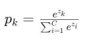
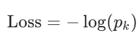
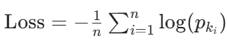

这次学习了softmax大体上跟线性回归模型的创建思路类似，但是在一些细节上不同，尤其是核心上它们的损失函数原理不同。

线性回归直接用均方误差来计算误差，因为预测值和真实值的误差是直白的就是大小的区别

但在处理图像时如果直白的用预测成功的是否，即0或1来记录损失，很难生成梯度供模型学习

所以我们先用softmax作为激活函数，将模型输出的"原始得分"转化为概率分布，也就是说假如我们要预测0到9，我们计算结果为0到9每个数字的概率分布

交叉熵损失公式
损失为 
批量计算时取平均值
最后得到了形如[0.2,0.7,0.1,0...0]的概率分布
注意这里我们用了one hot来表示真实值（虽然我直接用的pytorch的函数，没有自己写这个东西doge）
假如真实值是3 则表示为[0,0,0,1,0....0]
这样的好处是没有了大小的影响，我们的模型不会被误导，还方便我们直接跟预测值比较算出误差值。

